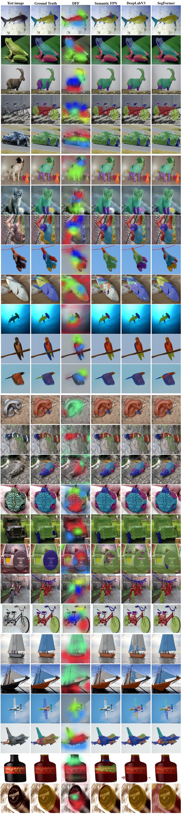

# [PartImageNet: A Large, High-Quality Dataset of Parts](https://arxiv.org/abs/2112.00933)

## The dataset is ready!
Links for downloading the dataset and annotation:
- [Google Drive](https://drive.google.com/drive/folders/1_sKq9g34dsKwfsgLo6j7WCe8Nfceq0Zo?usp=sharing)
- [Baidu Netdisk](https://pan.baidu.com/s/1ewlhL_wLhnI2INHZVBdq5g)(Access code: k99q)

Our annotations strictly follow the coco style so it should be easy to use the [cocoapi](https://github.com/cocodataset/cocoapi) for visulization the images and annotations.

If you find our work helpful in your research, please cite it as:

```
@article{he2021partimagenet,
  title={PartImageNet: A Large, High-Quality Dataset of Parts},
  author={He, Ju and Yang, Shuo and Yang, Shaokang and Kortylewski, Adam and Yuan, Xiaoding and Chen, Jie-Neng and Liu, Shuai and Yang, Cheng and Yuille, Alan},
  journal={arXiv preprint arXiv:2112.00933},
  year={2021}
}
```

## Introduction

PartImageNet is a large, high-quality dataset with part segmentation annotations. It consists of 158 classes from ImageNet with approximately 24′000 images. The classes are grouped into 11 super-categories and the parts split are designed according to the super-category as shown below. The number in the brackets after the category name indicates the total number of classes of the category.

| Category | Annotated Parts |
|:---:|:---:|
| Quadruped (46) | Head, Body, Foot, Tail |
| Biped (17) | Head, Body, Hand, Foot, Tail |
| Fish (10) | Head, Body, Fin, Tail |
| Bird (14) | Head, Body, Wing, Foot, Tail |
| Snake (15) | Head, Body |
| Reptile (20) | Head, Body, Foot, Tail |
| Car (23) | Body, Tier, Side Mirror |
| Bicycle (6) | Head, Body, Seat, Tier |
| Boat (4) | Body, Sail |
| Aeroplane (2) | Head, Body, Wing, Engine, Tail |
| Bottle (5) | Body, Mouth |

The statistics of train/val/test split is shown below.

| Split | Number of classes | Number of images |
|:---:|:---:|:---:|
| Train | 109 | 16540 |
| Val | 19 | 2957 |
| Test | 30 | 4598 |
| Total | 158 | 24095 |

For more detailed statistics, please check out our paper.

## Possible Usage

PartImageNet has broad potential in and can be benefit to numerious research fields while we simply explore its usage in Part Discovery, Few-shot Learning and Semantic Segmentation in the paper. We hope that with the propose of the PartImageNet, we could attarct more attention to the part-based models and yield more interesting works.

## Example Figures



  
